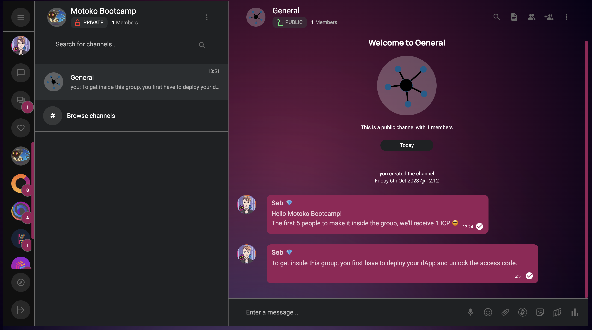
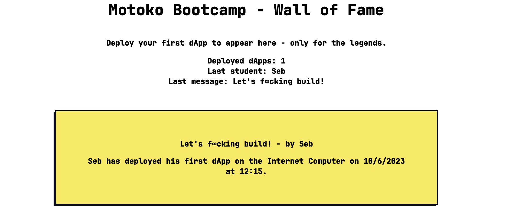

# Motoko Bootcamp - Deploy your first dApp in 90 minutes!

> Welcome to **Motoko Bootcamp**. This is a guided tutorial to help you deploy your first application on the Internet Computer in 90 minutes. You don't need any prior setup or configuration to use this repository. A GitHub account and Internet connection will be enough.

## Join me for a chat on the blockchain and get showcased on the Wall of Fame 😎

Do you think the **Internet Computer** sounds too good to be true? Let me prove you wrong!  
In a few minutes, you'll chat with me directly from the blockchain, showcasing the reality of this incredible technology. We'll use an application called **OpenChat**.   **OpenChat** is a fully featured chat application running end-to-end on the **Internet Computer**. **OpenChat** is also the first application to be completely open source and controlled by a **DAO**, the OpenChat **DAO**.  

But.. to hop into our exclusive **Motoko Bootcamp** group, you'll first have to accomplish your rite of passage and successfuly deploy your own first application.

  

Once you've showcased your skills, you'll have the opportunity to enter in the legend and let your marks on the **Wall Of Fame**. Ready to make history?

> The Wall of Fame is also a live applicaiton deployed on the Internet Computer - you can access it at the following url: https://aki3l-syaaa-aaaaj-qa23q-cai.icp0.io/

  

This tutorial is divided in 3 parts:

- **Part 1**: Use the Demo **dApp**.
  In this first part, we will use a demo dApp so that you can get familiar with the Motoko syntax and how to deploy applications. The code of the demo dApp has already been written for you.

- **Part 2**: Write your own **dApp**.
  In this second part, you'll be crafting your own dApp. To do that, follow a series of tasks with guidance.

- **Part 3**: Test your **dApp** and join us at Motoko Bootcamp for a full week of learning.
  In this final step, we'll check if your dApp functions correctly using a pre-deployed canister on the Internet Computer. This canister will interact with yours to ensure everything works right. Once verification have been made, you'll unlock access to the group and your name will be printed on the wall, forever.

## How to get started?

This repository contains a special tool called a **Dev Container**. This is a pre-configured environment that contains all the tools you need to get started with Motoko.  

You can use this environment in two ways:

- **Option 1 (Recommended):** Use the Dev Container in your browser. This is the easiest way to get started. You don't need to install anything. To do that, you need a **GitHub** account, make sure that you are logged in and click on **Code** - **Create Codespace**. This will takes 1-2 minutes before your coding environement is ready.

> There seems to be issues with **Brave Browser** when using **Codespaces** - we recommend using **Chrome** or **Firefox** for a smoothest experience for the duration of this workshop.

- **Option 2:** Use theDev Container on your computer. This option requires you to install Docker on your computer and takes more time. If you're interested, read this tutorial.

## Structure of the repository

This repository contains 4 folders:

- **.devcontainer:** This folder contains the configuration of the Dev Container. You don't need to change anything here.
- **assets**: This folder contains assets that are used in the tutorials. You don't need to change anything here.
- **tutorials**: This folder contains the tutorials. You don't need to change anything but you need to read them to follow this tutorial.
- **src:** This folder contains the source code of the dApps. You will read and write your code here.

Other files include:

- **README.md:** This file.
- **LICENSE.md:** The license of this repository.
- **devcontainer-template.json**: Another configuration file for the Dev Container.
- **.gitingore:** A configuration file that tells **Git** which files to ignore.
- **dfx.json**: The configuration file for using `dfx` which is a tool we will use to deploy our applications on the Internet Computer.

## Part 1: Use the Demo dApp.
This tutorial is avaiable [here](./tutorials/PART-1.MD)
## Part 2: Write your own dApp.
This tutorial is avaiable [here](./tutorials/PART-2.MD)
## Part 3: Test your dApp and join us for a full week of learning!
This tutorial is avaiable [here](./tutorials/PART-3.MD)
