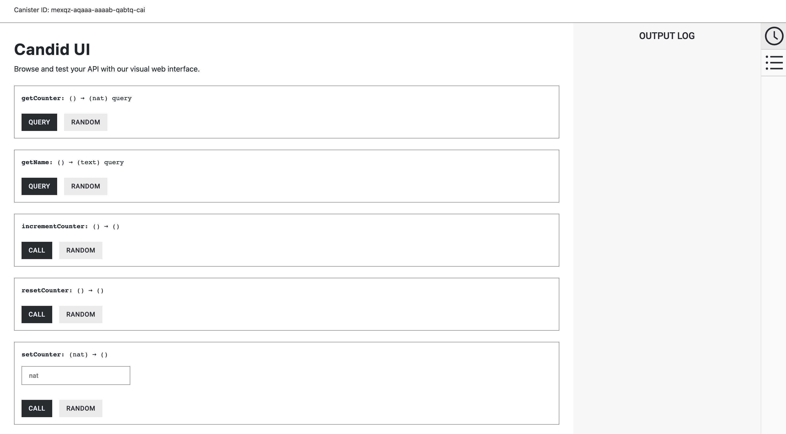

# Part 2: Write your own dApp.
> In this second part, you'll be crafting your own dApp. To do that, follow a series of tasks with guidance. Use the file [src/main.mo](../src/main.mo) to get started.

## Tasks
### Task 1 
Define a mutable variable of type `Nat` called `counter` and initialize it to `0`.
### Task 2
Define an immutable variable of type `Text` called `owner` and set it to your name.
### Task 3
Define a `query` function called `getOwner` that returns your name.
```
getOwner : shared query () -> async Text:
```
### Task 4 
Define a `query` function called `getCounter` that returns the value of the counter variable.
```
getCounter : shared query () -> async Nat;
```
### Task 5
Define an `update` function called `incrementCounter` that increments the value of the counter variable by 1 and returns the updated value of `counter`.
```
incrementCounter : shared () -> async Nat;
```
### Task 6
Define an `update` function called `resetCounter` that sets the value of the counter variable to 0 and returns nothing.
```
resetCounter : shared () -> async ();
```
### Task 7
Define an `update` function called `setCounter` that takes an argument called `n`, sets the value of `counter` to the value of `n` and returns nothing.
```
setCounter : shared (n : Nat) -> async ();
```
## Deploy your dApp to the Internet Computer
To deploy your canister, we will use the `dfx` command line tool again. Simply run the following.
```
$ dfx deploy --playground first_dapp
```

Note the canister id of your application and move to the next part.
## Interact with your dApp
The url to access the **Candid** interface for your canister is the following: `https://a4gq6-oaaaa-aaaab-qaa4q-cai.raw.icp0.io/?id=<YOUR_CANISTER_ID>`

<p align="center">  </p>
<p align="center"> </p>

You should see all of the public functions that we have defined. Try calling them and check what happens.
